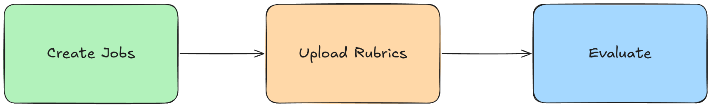
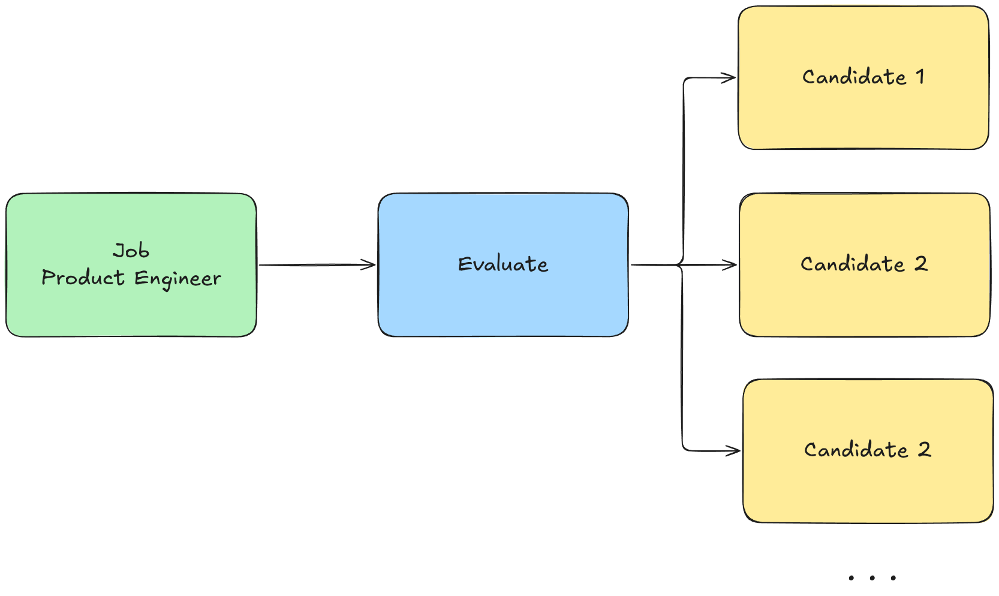

### 1. About
`ai-cv-evaluator` adalah sistem yang mengotomatisasi proses penyaringan kandidat menggunakan pipeline AI dengan mengevaluasi CV dan laporan proyek kemudian dicocokkan dengan lowongan pekerjaan serta brief studi kasus yang diberikan perusahaan.

---

### 2. Features
- **Evaluation Pipeline**: Proses evaluasi yang dilakukan mencakup ekstraksi data CV, pencocokan dengan lowongan, dan penilaian laporan proyek.

- **Async Architecture**: Menggunakan job queue (BullMQ & Redis) untuk menangani proses evaluasi yang berjalan lama tanpa memblokir API.

- **Objective Assessment with RAG**: Menggunakan Retrieval-Augmented Generation dengan vector database (pgvector) untuk menyuntikkan rubrik dan deskripsi pekerjaan sebagai konteks, memastikan penilaian yang konsisten.

- **Rich API**: Endpoint API untuk tim rekrutmen mengelola lowongan pekerjaan (`/jobs`) dan rubrik penilaian (`/rubrics`) secara mandiri.

- **Authentication & RBAC**: Sistem keamanan berbasis JWT dengan Role-Based Access Control (ADMIN & RECRUITER) untuk melindungi endpoint.

- **Error Handling**: Implementasi _retry_ otomatis dengan exponential _backoff_ jika terjadi kegagalan dan _logging error_ yang transparan.

---

### 3. Tech Stack
Daftar teknologi utama yang digunakan untuk membangun sistem evaluasi.

- Backend: Node.js, Express.js
- Database: PostgreSQL dengan ekstensi pgvector
- ORM: Prisma
- Job Queue: BullMQ, Redis
- AI/LLM: Google Gemini (`gemini-2.5-pro` & `gemini-embedding-001`)
- Autentikasi: JSON Web Tokens (JWT), bcrypt
- Kontainerisasi: Docker
- Lainnya: Joi (Validasi), Multer (File Upload), Papaparse (CSV)

---

### 4. Architecture
#### 4.1 Design Pattern


Model-View-Controller (MVC) digunakan karena pola ini sudah teruji dan memberikan struktur yang jelas untuk sebuah sistem _backend_.

Model MVC memberikan pemisahan tanggung jawab (_Separation of Concerns_) yang jelas (Model untuk data, View untuk UI, & Controller untuk kontrol) sehingga meningkatkan skalabilitas, modularitas, kemudahan pemeliharaan, dan pengujian sistem.

Kita dapat menguji logika bisnis di Model secara terpisah tanpa perlu melakukan _request_ HTTP sungguhan, hal ini membuat _unit testing_ menjadi lebih efisien.

**Kekurangannya** MVC bisa terasa sedikit berlebihan karena kita perlu membuat atau memodifikasi _file_ di beberapa direktori (misalnya, router, controller, model).

#### 4.2 API Layer


-  `POST /jobs`: Endpoint untuk membuat lowongan pekerjaan yang sedang atau akan dibuka.

>* Payload (multipart/form-data)

```
key: jobTitle | value: Product Engineer (Backend) 2025
key: jobDescriptionText | value: You'll be building new product features alongside a frontend engineer and product manager using our Agile methodology, as well as addressing issues to ensure our apps are robust and our codebase is clean. As a Product Engineer, you'll write clean, efficient code to enhance our product's codebase in meaningful ways...
key: studyCaseBrief | value: Mini Project - Backend 2025.pdf
```

>* Response

```
{
    "jobId": "product-engineer-backend-2025-zui4bvah"
    "message": "Job posting created successfully.",
}
```

>* Keuntungan memiliki endpoint `/jobs` tersendiri dibandingkan menggunakan `script seeder`.

> 

Membuat _endpoint_ API tersendiri untuk menangani lowongan pekerjaan (`/jobs`) memiliki beberapa keuntungan diantaranya:

>- Dinamis dan Skalabel: Ini adalah keuntungan terbesar. Tim rekrutmen dapat menambah, memperbarui, atau menghapus deskripsi pekerjaan kapan saja secara mandiri melalui API, tanpa perlu melibatkan tim developer. Ini sangat penting karena lowongan pekerjaan adalah data yang dinamis.

>- Real-time: Saat deskripsi pekerjaan baru ditambahkan melalui endpoint ini, ia langsung membuat _embedding_ dan menyimpannya ke _vector database_ sehingga tersedia untuk digunakan dalam proses evaluasi.

>- Pemisahan Tanggung Jawab: Ini memisahkan dengan jelas antara "data fondasi" (rubrik) yang jarang berubah dan "data operasional" (deskripsi pekerjaan) yang sering berubah.

-  `POST /rubrics`: Endpoint untuk menangani unggahan rubrik penilaian CV + Project Report.

>* Payload (multipart/form-data)

```
key: rubricFile | value: rubric_template.csv
```

>* Response

```
{
    "message": "Rubrics uploaded and saved successfully."
}
```

- `POST /upload`: Endpoint untuk menangani unggahan _file_ yang dibutuhkan CV + Project Report (plain text, PDF, or docx).

>* Payload (multipart/form-data)

```
key: cv | value: Software Engineer_Kholil Haq Alim Hakim.pdf
key: projectReport | value: Studi Kasus_Sistem Evaluasi Kandidat Berbasis AI.pdf
```

>* Response

```
{
    "message": "Files uploaded successfully.",
    "files": [
        {
            "id": "cmg6mjy370000i0uz04ur84ni",
            "originalFilename": "Software Engineer_Kholil Haq Alim Hakim.pdf",
            "storagePath": "uploads/Software Engineer_Kholil Haq Alim Hakim-31b561bb.pdf",
            "mimeType": "application/pdf",
            "fileSize": 298059,
            "createdAt": "2025-09-29T07:28:03.910Z"
        },
        {
            "id": "cmg6mjy370001i0uz8sxx33v4",
            "originalFilename": "Studi Kasus_Sistem Evaluasi Kandidat Berbasis AI.pdf",
            "storagePath": "uploads/(Studi Kasus_ Sistem Evaluasi Kandidat Berbasis AI)-1405a540.pdf",
            "mimeType": "application/pdf",
            "fileSize": 99046,
            "createdAt": "2025-09-29T07:28:03.910Z"
        }
    ]
}
```

- `POST /evaluate`: Endpoint utama untuk memulai proses evaluasi. Payload akan berisi referensi ID dari _file-file_ yang telah diunggah dan _job description_.

>* Payload (application/json)
```
{
   "jobId": "product-engineer-backend-2025-zui4bvah",
   "cvFileId": "cmg6mjy370000i0uz04ur84ni",
   "projectReportFileId": "cmg6mjy370001i0uz8sxx33v4"
}
```

- `GET /result/{id}`: Endpoint untuk memeriksa status proses (_queued_, _processing_, _completed_) dan mengambil hasil akhir evaluasi.

>* queued or processing
```
{
    "id": "cmg76o92i0001i0zkq4een97a",
    "status": "queued"
}
```

>* completed
```
{
    "id": "cmg76o92i0001i0zkq4een97a",
    "status": "completed",
    "result": {
        "cv_match_rate": 0.86,
        "cv_feedback": "Relevant LLM experience despite short tenure.",
        "project_score": 9.5,
        "project_feedback": "Exceptional, senior-level execution with production-ready architecture.",
        "overall_summary": "Strong hire; project performance confirms senior-level engineering capabilities."
    }
}
```

#### 4.3 Async Process
Evaluasi akan dijalankan di latar belakang (_background worker_) untuk menjaga API tetap responsif, dengan ekspektasi waktu proses **2-3 menit** per kandidat.

Jika terjadi antrian, status akan tetap _processing_ hingga selesai.

#### 4.4 AI Evaluation Pipeline (Gemini 2.5 Pro)

1. **PII Anonymization**: Sistem akan menyamarkan data pribadi (email & no. telepon) dari CV sebelum diproses lebih lanjut.

2. **CV Extraction**: Panggilan LLM pertama untuk mengubah CV menjadi data terstruktur (keahlian/skills, pengalaman/experiences, proyek/projects).

3. **CV Matching**: Panggilan LLM kedua, menggunakan RAG untuk menyuntikkan konteks dari rubrik evaluasi CV guna membandingkan data CV dengan job description.

4. **Project Deliverable Evaluation**: Panggilan LLM ketiga, menggunakan RAG untuk menyuntikkan konteks dari rubrik evaluasi proyek dan brief studi kasus yang dinamis guna menilai _project report_ kandidat.

5. **Verification (Refine)**: Panggilan LLM keempat (_final_) yang bertindak sebagai "kritikus" untuk memverifikasi hasil.

### 5. API Documentation
Click to see the [Full API Documentation](https://documenter.getpostman.com/view/37506443/2sB3QFRsS1)

### 6. Getting Started
Berikut adalah cara bagaimana kamu dapat menjalankan proyek ini di mesin lokal mu.

1. Prasyarat

- Node.js, Docker (untuk PostgreSQL, Redis, & Adminer).

2. Instalasi

- Jalankan `git clone ...`, `npm install`, `docker compose up -d`.

3. Konfigurasi

- Buat _file_ `.env` baru. Untuk isi kontennya cek `.env.example` (variabel `DATABASE_URL`, `GEMINI_API_KEY`, `JWT_SECRET`, dll.).

4. Setup Database

- Menjalankan `npx prisma migrate dev`.

5. Seeding Data Awal
- Menjalankan `npm run seed_admin` untuk membuat pengguna admin pertama.
- Menjalankan `npm run seed_rubric` untuk membuat rubrik penilaian.

6. Menjalankan Aplikasi

- `npm run dev` untuk menyalakan API Server.

7. Menjalankan Tes
- `npm test` untuk menjalankan unit test.